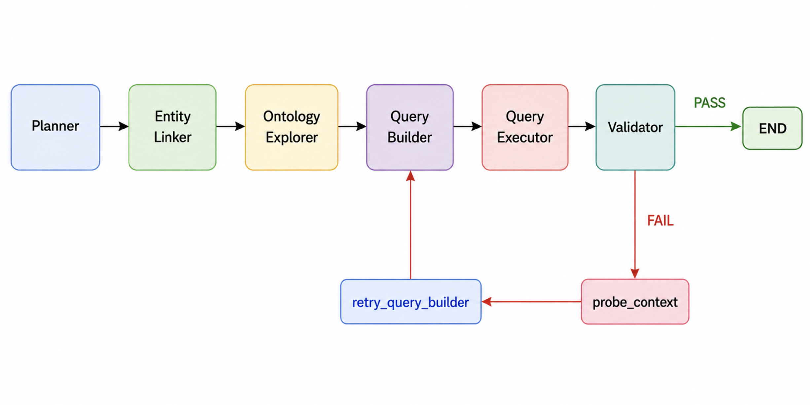

# Agentic Question Answering over DBpedia

| Project Details | |
|---|---|
| Contributor | Malla Siddharth Reddy |
| Organization | DBpedia |
| Mentors | Tommaso Soru, Ronit Banerjee, Gandharva Naveen, Abdulsobur |
| Blog | https://mallasiddharthreddy.github.io/blogs/gsoc-26/ |

GSoC 2026 · DBpedia — an agentic LangGraph pipeline that translates natural language
questions into SPARQL queries against the DBpedia knowledge graph, using live-probe
grounding instead of a static dbp: index to recover from a wrong first guess.

> **Text2SPARQL 2026 (DB26), 50 questions: F1 = 0.6119 with Claude Sonnet 4.6** — a 90%+
> relative improvement over the pre-GSoC baseline (0.32), competitive with 2nd place on
> the official leaderboard (0.614). F1 = 0.5109 with Qwen 3.5 122B, a ~65% improvement
> over its own baseline (0.31).

---

## How It Works

The pipeline consists of six LangGraph nodes that run in sequence:

1. **Planner** — Analyses the question and extracts entities, concepts, answer type, aggregator, join type, whether a type filter is needed, and the number of relationship hops (`num_hops`) required to answer the question
2. **Entity Linker** — Maps entity mentions to DBpedia resource URIs using a Redis surface-form index with LLM disambiguation
3. **Ontology Explorer** — Looks up the top-15 most semantically similar dbo: properties for each concept using a Nomic Embed v1.5 cosine index, then enriches each candidate with rdfs:domain, rdfs:range, and rdfs:label from the DBpedia OWL ontology file via the Schema Introspector
4. **Query Builder** — Generates a SPARQL query using the linked entities and ontology candidates, treating `num_hops` from the Planner as a hard constraint on query structure
5. **Query Executor** — Executes the query against the DBpedia endpoint with a class-safe deterministic dbo: to dbp: namespace swap as a first-level fallback
6. **Validator** — Inspects the result and either passes, retries the Query Builder with live agentic probe context, or gives up



The Validator runs a two-stage agentic probe when a query fails (Stage 1 keyword-filtered
dbp: search on the subject, Stage 2 falls back to listing all dbp: properties for that
entity), plus three targeted checks:

- **Dead URI detection** — if a subject URI returns zero properties even from an unfiltered probe, checks for DBpedia disambiguation suffixes (e.g. `_(series)`) and retries with the cleaned URI instead of giving up
- **Two-hop probe chaining** — for multi-hop questions (`num_hops >= 2`), resolves what the intermediate variable in the query actually binds to and probes that entity too, not just the original subject
- **Type-aware probe filtering** — when probing the original subject of a multi-hop question, only accepts properties with a resource-URI value, since that value needs to be usable as the subject of the next triple

Probe results are injected as grounded context into the Query Builder on retry. See
Architecture Decisions below for why each of these exists.

A browser-based UI is also available for live demonstration, showing every step of the
pipeline (including hop count, agentic probe results, and validator decisions) as it
runs. See "Run It" below.

---

## Requirements

- Python 3.13
- Redis server (optional, for entity linking — see Setup)
- OpenRouter API key (or any OpenAI-compatible provider)
- DBpedia SPARQL endpoint access

---

## Setup

**1. Install dependencies:**
```bash
pipenv install
```

**2. Environment variables:**

Create a `.env` file in the project root:
```
OPENROUTER_API_KEY=your_openrouter_api_key_here
NEF_REDIS_HOST=your_redis_host
NEF_REDIS_PORT=6379
NEF_REDIS_PASSWORD=your_redis_password
```
LLM calls go through OpenRouter by default. To use a different OpenAI-compatible
provider (local, Bedrock, etc.), edit `_get_llm_client()` in `src/agent.py` and
`_get_judge_client()` in `src/evaluate.py`.

**3. Build the dbo ontology index:**

The DBpedia OWL ontology file is included in the repo at `resources/dbpedia-20250806.owl.rdf`, no separate download needed.
```bash
pipenv run python scripts/build_ontology_index.py
```
Produces `data/nomic_embeddings_dbo.pt`, `data/nomic_uris_dbo.json`, `data/nomic_labels_dbo.json`.

**4. Redis entity linking (optional):**

Uses a Redis database pre-loaded with DBpedia surface forms. Contact the project
maintainers for access, or refer to the DBpedia entity linking documentation. Not
strictly required: without it, the pipeline falls back to constructing entity URIs
directly from the name, with lower linking accuracy.

**5. DBpedia endpoint:**

All queries go to `http://research.liberai.org:7878/sparql`. To point at a different
endpoint, update the `ENDPOINT` constant in `src/sparql_client.py`, `src/evaluate.py`,
`scripts/build_db26_gold.py`, and `scripts/build_db25_gold.py`.

---

## Run It

**Single question:**
```bash
pipenv run python -c "
from src.agent import KGQAAgent
agent = KGQAAgent()
print(agent.answer('What is the birthplace of Keanu Reeves?'))
"
```

**Streaming UI:**
```bash
pipenv run uvicorn src.api:app --host 0.0.0.0 --port 8000 --reload
```
Open `http://localhost:8000`. Type a question and watch the pipeline's steps live —
Planner analysis, entity linking, ontology lookup, generated SPARQL, executor fallback,
validator decisions, and full agentic probe results, exactly as they print in the terminal.

**Evaluations:**
```bash
# Build the gold result cache first (run once per benchmark)
pipenv run python scripts/build_db26_gold.py
pipenv run python scripts/build_db25_gold.py

# n_questions  model_id  start_index  benchmark
pipenv run python -m src.evaluate 50 anthropic/claude-sonnet-4.6 0 db26
pipenv run python -m src.evaluate 100 deepseek/deepseek-v3.2 0 db25
```
Each run reports F1, precision, recall, and average/median/mode agent steps per
question. Results save to `data/evals/eval_{benchmark}_{timestamp}.json`.

---

## Results

| Benchmark | Model | Result-set match | Avg F1 |
|---|---|---|---|
| Text2SPARQL 2026 DB26 (50 Q) | Claude Sonnet 4.6 | 27/50 (54%) | **0.6119** |
| Text2SPARQL 2026 DB26 (50 Q) | Qwen 3.5 122B | 22/50 (44%) | 0.5109 |
| Text2SPARQL 2026 DB26 (50 Q) | LIBER-AI-CLAUDE (pre-GSoC baseline) | — | 0.32 |
| Text2SPARQL 2026 DB26 (50 Q) | LIBER-AI-QWEN (pre-GSoC baseline) | — | 0.31 |
| Text2SPARQL 2025 DB25 (100 Q) | DeepSeek v3.2 | 50/100 (50%) | 0.5538 |

Claude's F1 = 0.6119 is a 90% relative improvement over the LIBER-AI-CLAUDE baseline and
competitive with 2nd place on the official Text2SPARQL 2026 leaderboard (F1 = 0.614).
Several DB25 gold queries have compatibility issues with the evaluation endpoint
(invalid SPARQL COUNT/SUM syntax, a few genuine full-scan timeouts), so true pipeline
performance on well-formed DB25 questions is somewhat higher than the aggregate suggests.

Full raw output for all three final runs is in `eval-results/`. For a per-question
breakdown of every DB26 failure on Claude and Qwen, a categorised analysis of the cause,
and what would move F1 beyond the current best, see `docs/final-results-analysis.md`.

---

## Repository Layout

| Path | What |
|---|---|
| `src/agent.py` | LangGraph pipeline: all node functions, `KGQAState`, `build_graph()` |
| `src/sparql_client.py` | Centralised SPARQL execution |
| `src/query_executor.py` | Query execution with the dbo->dbp swap |
| `src/validator.py` | Validator node: agentic probe, dead URI detection, two-hop probe chaining, type-aware filtering |
| `src/ontology_lookup.py` | dbo: embedding index lookup (Nomic Embed v1.5) |
| `src/schema_introspector.py` | OWL metadata enrichment (domain, range, label) |
| `src/entity_linking.py` | Redis-based entity linking |
| `src/evaluate.py` | Evaluation harness: P/R/F1 and steps metrics |
| `src/api.py` | FastAPI streaming endpoint + web UI |
| `scripts/` | Index and gold-cache build scripts |
| `benchmark/` | Text2SPARQL DB26 and DB25 question sets |
| `resources/dbpedia-20250806.owl.rdf` | DBpedia OWL ontology file (included in repo) |
| `images/flow.png` | Pipeline flow diagram used in this README |
| `eval-results/` | Full raw output of the three final confirmed evaluation runs |
| `data/` | Index files, gold caches, eval results (gitignored, generated by Setup) |
| `docs/final-results-analysis.md` | Per-question failure analysis for Claude and Qwen on DB26, and what's next |

---

## Architecture Decisions

**dbo-only ontology index:** The pipeline uses only the curated dbo: ontology for static property lookup, dropping an earlier AI-labelled dbp: index. A controlled comparison on DB26 showed the two approaches were statistically indistinguishable in performance, while the dbo-only approach is simpler and more scientifically defensible and scalable. dbp: properties still enter the pipeline via the deterministic swap and the live agentic probe.

**Agentic probe over static dbp: index:** Instead of embedding 49k dbp: properties with AI-generated labels (not reproducible at scale), the Validator queries the live endpoint to discover which dbp: properties actually have data for a given subject entity. This grounds the Query Builder's retry in real confirmed data rather than embedding similarity.

**Class-safe dbo to dbp swap:** The deterministic namespace swap only rewrites lowerCamelCase property URIs. UpperCamelCase class URIs (used in rdf:type constraints) are left untouched since no dbp: equivalent exists for classes like dbo:FictionalCharacter.

**num_hops as an explicit Planner field:** Multi-hop questions were sometimes collapsed into a single triple when the Query Builder inferred hop count purely from natural language phrasing. The Planner now explicitly outputs `num_hops`, and the Query Builder treats it as a hard constraint (e.g. `num_hops=2` must produce exactly two triples connected by an intermediate variable), removing this class of structural error.

**Dead URI detection:** When the Entity Linker falls back to a heuristic URI construction (on a Redis miss) and that heuristic includes a DBpedia disambiguation suffix like `_(series)`, the constructed URI can point to a non-existent resource. The Validator detects this — when the unfiltered probe finds zero properties for a subject — strips the suffix, and retries with the cleaned canonical URI.

**Two-hop probe chaining:** For multi-hop questions, the original subject-only probe could never discover a second-hop property that only exists on the intermediate entity (e.g. a country's area, when the question starts from a university located in that country). The Validator now resolves what the intermediate variable actually binds to and probes that entity as well.

**Type-aware probe filtering:** When probing the first hop of a multi-hop question, only properties with a resource-URI value are surfaced, since that value must be usable as the subject of the second triple. A plain string value found by the probe (e.g. a literal describing a unit's parent organisation) can never be joined further, so accepting it would only produce another failed retry.
